---
## Front matter
title: "Отчёт по лабораторной работе №6"
subtitle: "Дисциплина: Архитектура компьютера"
author: "Мария Данииловна Гольцова"

## Generic otions
lang: ru-RU
toc-title: "Содержание"

## Bibliography
bibliography: bib/cite.bib
csl: pandoc/csl/gost-r-7-0-5-2008-numeric.csl

## Pdf output format
toc: true # Table of contents
toc-depth: 2
lof: true # List of figures
lot: true # List of tables
fontsize: 12pt
linestretch: 1.5
papersize: a4
documentclass: scrreprt
## I18n polyglossia
polyglossia-lang:
  name: russian
  options:
	- spelling=modern
	- babelshorthands=true
polyglossia-otherlangs:
  name: english
## I18n babel
babel-lang: russian
babel-otherlangs: english
## Fonts
mainfont: PT Serif
romanfont: PT Serif
sansfont: PT Sans
monofont: PT Mono
mainfontoptions: Ligatures=TeX
romanfontoptions: Ligatures=TeX
sansfontoptions: Ligatures=TeX,Scale=MatchLowercase
monofontoptions: Scale=MatchLowercase,Scale=0.9
## Biblatex
biblatex: true
biblio-style: "gost-numeric"
biblatexoptions:
  - parentracker=true
  - backend=biber
  - hyperref=auto
  - language=auto
  - autolang=other*
  - citestyle=gost-numeric
## Pandoc-crossref LaTeX customization
figureTitle: "Рис."
tableTitle: "Таблица"
listingTitle: "Листинг"
lofTitle: "Список иллюстраций"
lotTitle: "Список таблиц"
lolTitle: "Листинги"
## Misc options
indent: true
header-includes:
  - \usepackage{indentfirst}
  - \usepackage{float} # keep figures where there are in the text
  - \floatplacement{figure}{H} # keep figures where there are in the text
---

# Цель работы

Освоить арифметические инструкции языка ассемблера NASM.

# Выполнение лабораторной работы

Создала каталог для программ лабораторной работы №6, перешла в него и
создала файл lab6-1.asm (рис. @fig:001).

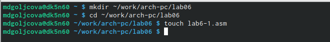{#fig:001 width=70%}

Ввела в файл lab6-1.asm текст программы из листинга 6.1 (рис. @fig:002). 

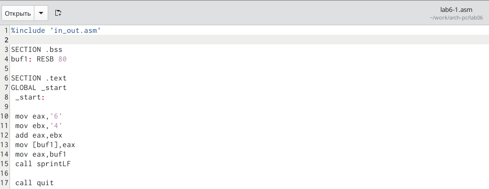{#fig:002 width=70%}

Создала исполняемый файл и запустила его (рис. @fig:003).

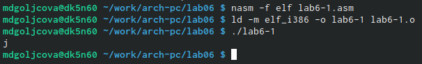{#fig:003 width=70%}

Далее изменила текст программы и вместо символов записала в регистры числа (рис. @fig:004).

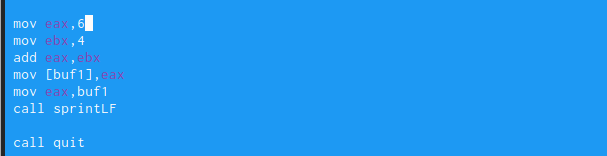{#fig:004 width=70%}

Создала исполняемый файл и запустила его (рис. @fig:005).

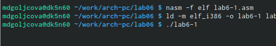{#fig:005 width=70%}

Создала файл lab6-2.asm в каталоге ~/work/arch-pc/lab06 (рис. @fig:006).

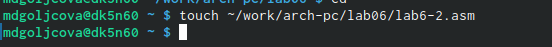{#fig:006 width=70%}

Ввела в него текст программы из листинга 6.2 (рис. @fig:007).

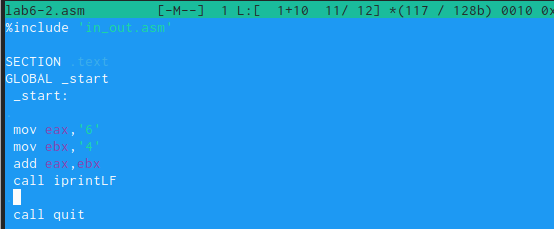{#fig:007 width=70%}

Создала исполняемый файл и запустила его (рис. @fig:008).

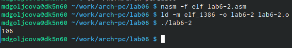{#fig:008 width=70%}

Аналогично предыдущему примеру изменила символы на числа (рис. @fig:009).

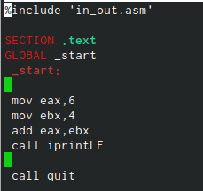{#fig:009 width=70%}

Создала исполняемый файл и запустила его. В результате было получено число 10 (рис. @fig:010).

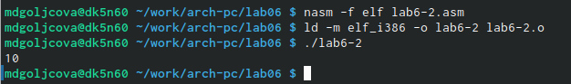{#fig:010 width=70%}

Заменила функцию iprintLF на iprint (рис. @fig:011).

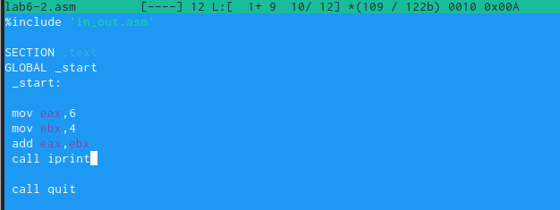{#fig:011 width=70%}

В результате было выведено число 10 не на отдельной строке (рис. @fig:012).

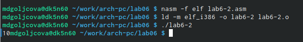{#fig:012 width=70%}

Создала файл lab6-3.asm в каталоге ~/work/arch-pc/lab06 (рис. @fig:013).

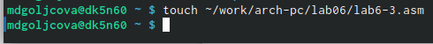{#fig:013 width=70%}

Внимательно изучила текст программы из листинга 6.3 и ввела в lab6-3.asm (рис. @fig:014).

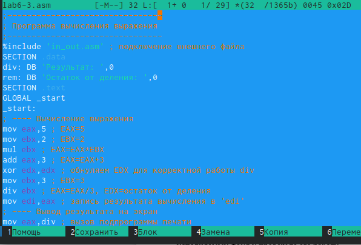{#fig:014 width=70%}

Создала исполняемый файл и запустила его (рис. @fig:015).

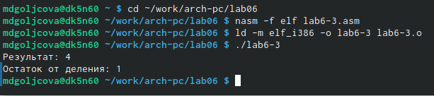{#fig:015 width=70%}

Изменила текст программы для вычисления выражения 𝑓(𝑥) = (4 ∗ 6 + 2)/5 (рис. @fig:016).

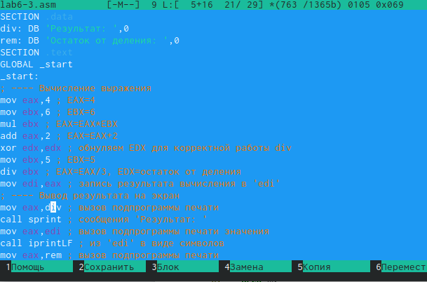{#fig:016 width=70%}

Создала исполняемый файл и проверила его работу. Получено: результат - 15, остаток от деления - 1 (рис. @fig:017).

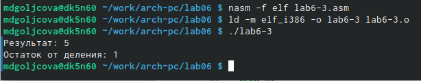{#fig:017 width=70%}

Создала файл variant.asm в каталоге ~/work/arch-pc/lab06 (рис. @fig:018).

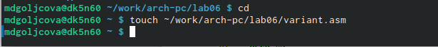{#fig:018 width=70%}

Внимательно изучила текст программы из листинга 6.4 и ввела в файл variant.asm (рис. @fig:019).

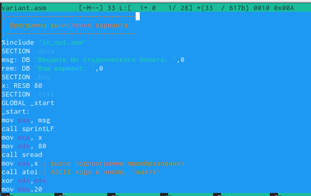{#fig:019 width=70%}

Создала исполняемый файл и запустила его (рис. @fig:020).

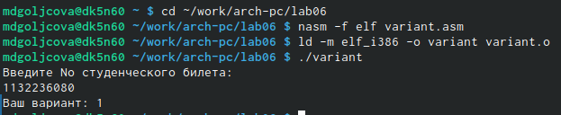{#fig:020 width=70%}

# Ответы на вопросы

1. За вывод сообщения "Ваш вариант" отвечают строчки кода
mov eax,rem
call sprint

2. Инструкция mov ес, х используется, чтобы положить адрес вводимой строки х в регистр есх mov edx, 80 - запись в регистр edx длины вводимой строки call sread - вызов подпрограммы из внешнего файла, обеспечивающей ввод сообщения с клавиатуры.

3. call atoi используется для вызова подпрограммы из внешнего файла, которая преобразует ascii-код символа в целое число и записывает результат в регистр eax.

4. За вычисления варианта отвечают строки:
хот edx,edx ; обнуление еах для корректной работы div
mov ebx, 20 ; ebx = 20
div ebx; eax = eax/20, edx - остаток от деления
inc edx; edx = edx + 1

5. При выполнении инструкции div ebx остаток от деления записывается в регистр edx.

6. Инструкция inc edx увеличивает значение регистра edx на 1.

7. За вывод на экран результатов вычислений отвечают строки:
mov eax,edx
call iprintLF

# Самостоятельная работа

Создала файл sr.asm в каталоге ~/work/arch-pc/lab06 (рис. @fig:021).

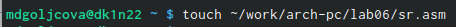{#fig:021 width=70%}

Написала программу вычисления выражения 𝑦 = (10 + 2𝑥)/3 (рис. @fig:022).

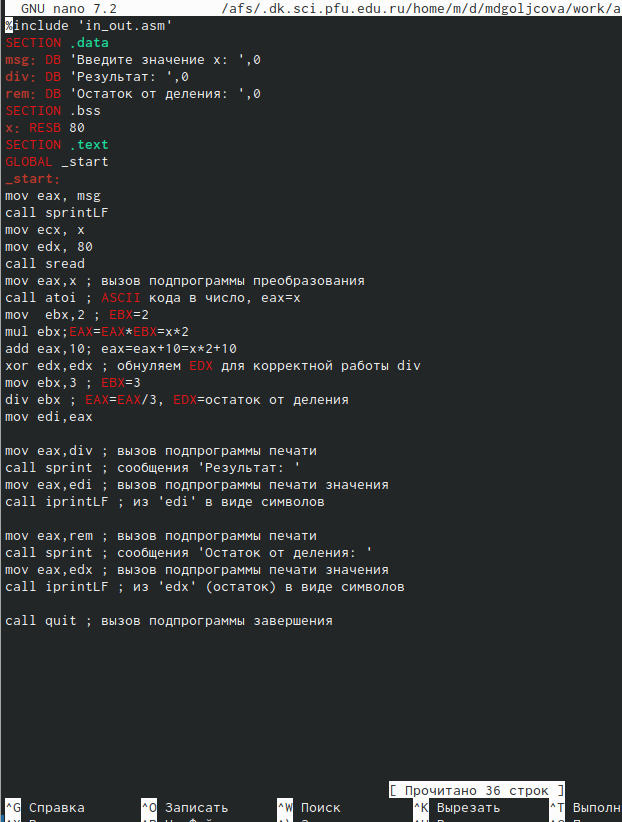{#fig:022 width=70%}

Подставила значение х1 = 1 (рис. @fig:023).

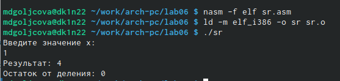{#fig:023 width=70%}

Подставила значение х2 = 10 (рис. @fig:024).

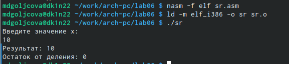{#fig:024 width=70%}

# Выводы

Я освоила арифметические инструкции языка ассемблера NASM.

# Список литературы{.unnumbered}

::: {#refs}
:::
