---
## Front matter
title: "Отчёт по лабораторной работе №7"
subtitle: "Дисциплина: Архитектура компьютера"
author: "Мария Данииловна Гольцова"

## Generic otions
lang: ru-RU
toc-title: "Содержание"

## Bibliography
bibliography: bib/cite.bib
csl: pandoc/csl/gost-r-7-0-5-2008-numeric.csl

## Pdf output format
toc: true # Table of contents
toc-depth: 2
lof: true # List of figures
lot: true # List of tables
fontsize: 12pt
linestretch: 1.5
papersize: a4
documentclass: scrreprt
## I18n polyglossia
polyglossia-lang:
  name: russian
  options:
	- spelling=modern
	- babelshorthands=true
polyglossia-otherlangs:
  name: english
## I18n babel
babel-lang: russian
babel-otherlangs: english
## Fonts
mainfont: PT Serif
romanfont: PT Serif
sansfont: PT Sans
monofont: PT Mono
mainfontoptions: Ligatures=TeX
romanfontoptions: Ligatures=TeX
sansfontoptions: Ligatures=TeX,Scale=MatchLowercase
monofontoptions: Scale=MatchLowercase,Scale=0.9
## Biblatex
biblatex: true
biblio-style: "gost-numeric"
biblatexoptions:
  - parentracker=true
  - backend=biber
  - hyperref=auto
  - language=auto
  - autolang=other*
  - citestyle=gost-numeric
## Pandoc-crossref LaTeX customization
figureTitle: "Рис."
tableTitle: "Таблица"
listingTitle: "Листинг"
lofTitle: "Список иллюстраций"
lotTitle: "Список таблиц"
lolTitle: "Листинги"
## Misc options
indent: true
header-includes:
  - \usepackage{indentfirst}
  - \usepackage{float} # keep figures where there are in the text
  - \floatplacement{figure}{H} # keep figures where there are in the text
---

# Цель работы

Изучить команды условного и безусловного переходов. Приобрести навыки написания
программ с использованием переходов. Познакомиться с назначением и структурой файла
листинга.

# Выполнение лабораторной работы

Создала каталог для программ лабораторной работы №7, перешла в него и создала файл lab7-1.asm (рис. @fig:001).

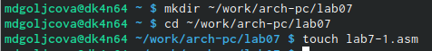{#fig:001 width=70%}

Ввела в файл lab7-1.asm текст программы из листинга 7.1 (рис. @fig:002).

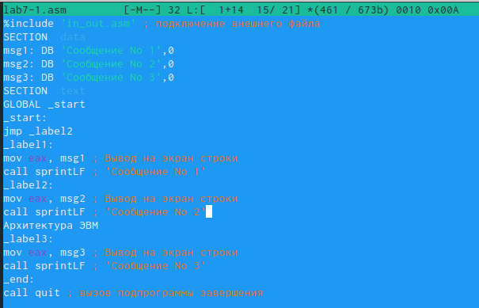{#fig:002 width=70%}

Создала исполняемый файл и запустила его (рис. @fig:003).

{#fig:003 width=70%}

Изменила текст программы в соответствии с листингом 7.2 (рис. @fig:004).

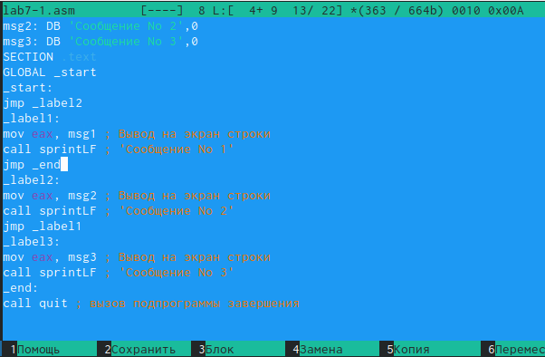{#fig:004 width=70%}

Создала исполняемый файл и проверила его работу (рис. @fig:005).

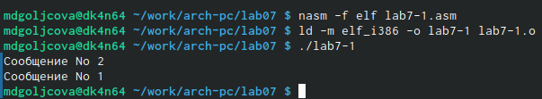{#fig:005 width=70%}

Изменила текст программы, добавив или изменив инструкции jmp (рис. @fig:006).

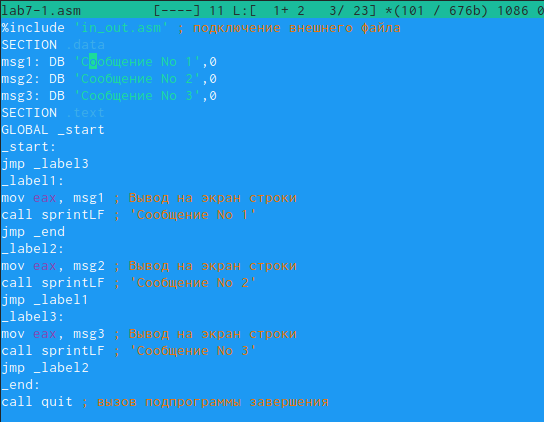{#fig:006 width=70%}

В результате получила следующее (рис. @fig:007).

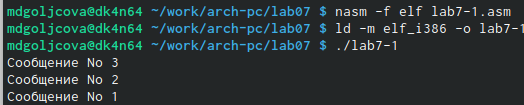{#fig:007 width=70%}

Создала файл lab7-2.asm в каталоге ~/work/arch-pc/lab07 (рис. @fig:008).

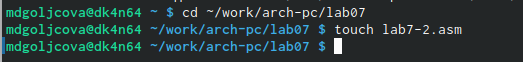{#fig:008 width=70%}

Внимательно изучила текст программы из листинга 7.3 и ввела в lab7-2.asm (рис. @fig:009).

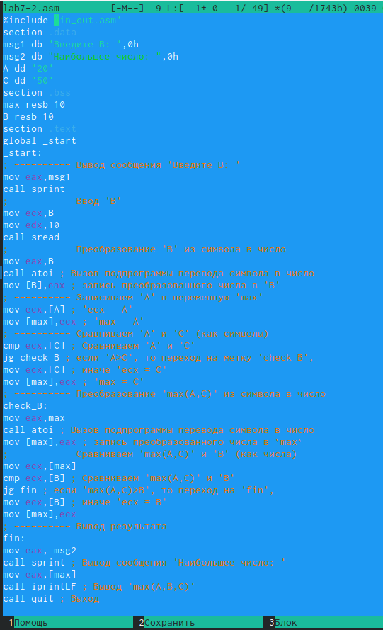{#fig:009 width=70%}

Создала исполняемый файл и проверила его работу для значения B = 5 (рис. @fig:010).

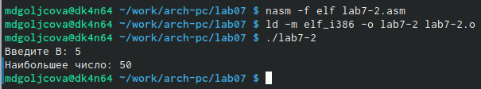{#fig:010 width=70%}

Для значения В = 98 (рис. @fig:011).

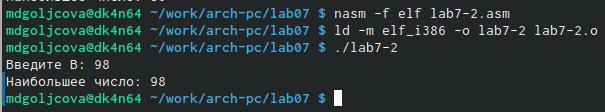{#fig:011 width=70%}

Создала файл листинга для программы из файла lab7-2.asm (рис. @fig:012).

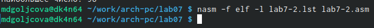{#fig:012 width=70%}

Открыла файл листинга lab7-2.lst с помощью любого текстового редактора mcedit (рис. @fig:013).

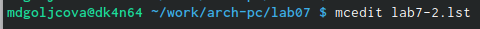{#fig:013 width=70%}

Внимательно ознакомилась с его форматом и содержимым (рис. @fig:014).

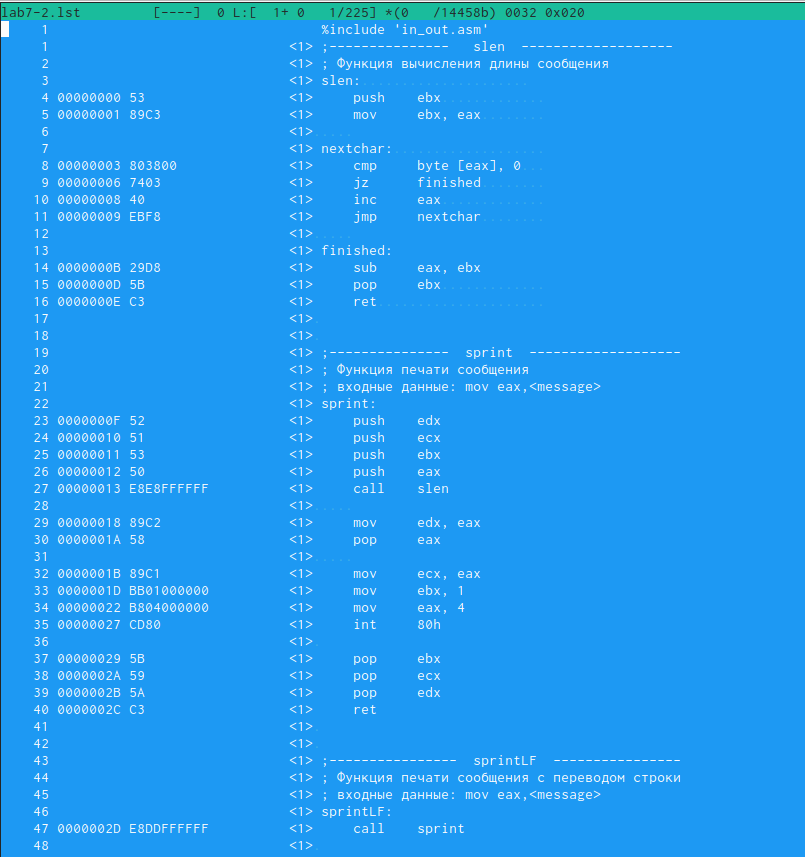{#fig:014 width=70%}

Описание пятой строки: номер строки, адрес строки, машинный код (по вызову и присваиванию регистра), исходный текст программы.
Описание одиннадцатой строки: номер строки, адрес строки, машинный код (по переходу на другую строку), исходный текст программы.
Описание тридцать девятой строки: номер строки, адрес строки, машинный код (по сравнению чисел), исходный текст программы; 
квадратные скобки указывают на значение числа В.

Открыла файл с программой lab7-2.asm и в инструкции с двумя операндами удалила один операнд (рис. @fig:015).

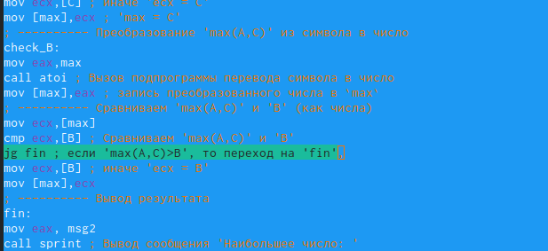{#fig:015 width=70%}

Выполнила трансляцию с получением файла листинга (рис. @fig:016).

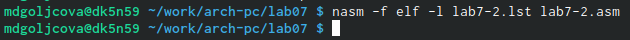{#fig:016 width=70%}

Транслятор выводит ошибку.

Создала файл для самостоятельной работы (рис. @fig:017).

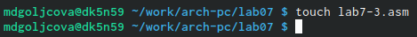{#fig:017 width=70%}

Написала программу нахождения наименьшей из 3 целочисленных переменных A,B и C (рис. @fig:018).

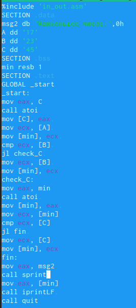{#fig:018 width=70%}

В соответствии со своим вариантом из лабораторной работы №6 (1) получила ответ (рис. @fig:019).

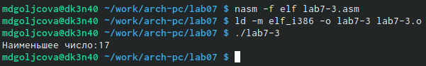{#fig:019 width=70%}

Создала второй файл для самостоятельной работы (рис. @fig:020).

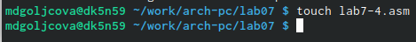{#fig:020 width=70%}

Написала программу, которая для введенных с клавиатуры значений 𝑥 и 𝑎 вычисляет
значение заданной функции 𝑓(𝑥) и выводит результат вычислений (рис. @fig:021).

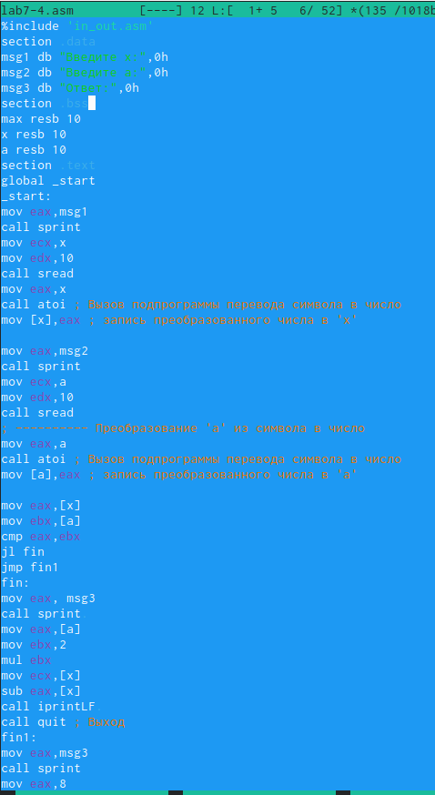{#fig:021 width=70%}

Работа программы при разных значениях 1-го варианта (рис. @fig:022).

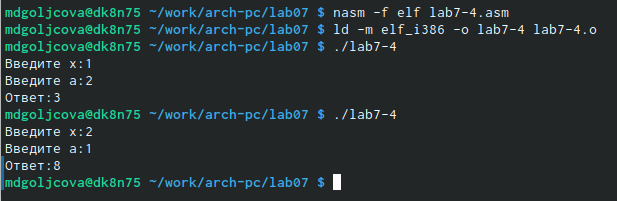{#fig:022 width=70%}

# Выводы

Изучила команды условного и безусловного переходов. Приобрела навыки написания
программ с использованием переходов. Познакомилась с назначением и структурой файла
листинга.

# Список литературы{.unnumbered}

::: {#refs}
:::
