---
## Front matter
title: "Отчёт по лабораторной работе №8"
subtitle: "Дисциплина: Архитектура компьютера"
author: "Мария Данииловна Гольцова"

## Generic otions
lang: ru-RU
toc-title: "Содержание"

## Bibliography
bibliography: bib/cite.bib
csl: pandoc/csl/gost-r-7-0-5-2008-numeric.csl

## Pdf output format
toc: true # Table of contents
toc-depth: 2
lof: true # List of figures
lot: true # List of tables
fontsize: 12pt
linestretch: 1.5
papersize: a4
documentclass: scrreprt
## I18n polyglossia
polyglossia-lang:
  name: russian
  options:
	- spelling=modern
	- babelshorthands=true
polyglossia-otherlangs:
  name: english
## I18n babel
babel-lang: russian
babel-otherlangs: english
## Fonts
mainfont: PT Serif
romanfont: PT Serif
sansfont: PT Sans
monofont: PT Mono
mainfontoptions: Ligatures=TeX
romanfontoptions: Ligatures=TeX
sansfontoptions: Ligatures=TeX,Scale=MatchLowercase
monofontoptions: Scale=MatchLowercase,Scale=0.9
## Biblatex
biblatex: true
biblio-style: "gost-numeric"
biblatexoptions:
  - parentracker=true
  - backend=biber
  - hyperref=auto
  - language=auto
  - autolang=other*
  - citestyle=gost-numeric
## Pandoc-crossref LaTeX customization
figureTitle: "Рис."
tableTitle: "Таблица"
listingTitle: "Листинг"
lofTitle: "Список иллюстраций"
lotTitle: "Список таблиц"
lolTitle: "Листинги"
## Misc options
indent: true
header-includes:
  - \usepackage{indentfirst}
  - \usepackage{float} # keep figures where there are in the text
  - \floatplacement{figure}{H} # keep figures where there are in the text
---

# Цель работы

Приобретение навыков написания программ с использованием циклов и обработкой
аргументов командной строки.

# Выполнение лабораторной работы

Создала каталог для программам лабораторной работы №8, перешла в него и создала
файл lab8-1.asm (рис. @fig:001).

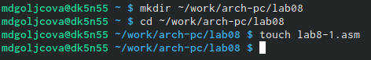{#fig:001 width=70%}

Ввела в файл lab8-1.asm текст программы из листинга 8.1 (рис. @fig:002). 

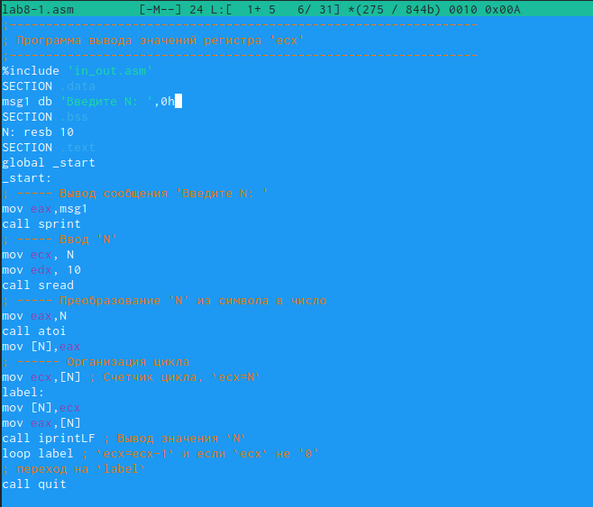{#fig:002 width=70%}

Создала исполняемый файл и проверила его работу (рис. @fig:003).

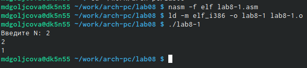{#fig:003 width=70%}

Изменила текст программы, добавив изменение значение в регистра ecx в цикле (рис. @fig:004).

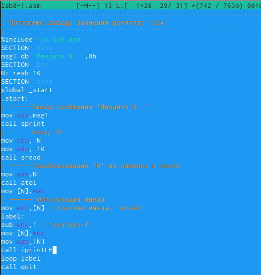{#fig:004 width=70%}

Создала исполняемый файл и проверила его работу (рис. @fig:005).

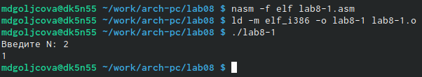{#fig:005 width=70%}

Внесла изменения в текст программы, добавив команды push
и pop (добавления в стек и извлечения из стека) для сохранения значения счетчика цикла
loop (рис. @fig:006).

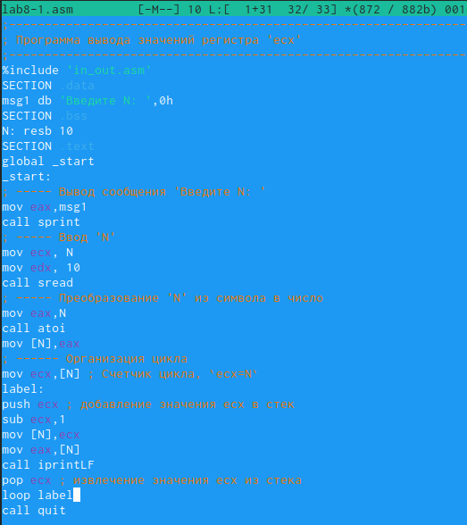{#fig:006 width=70%}

Создала исполняемый файл и проверила его работу. Программа показывает все предыдущие числа до 0, 
не включая заданное N (рис. @fig:007).

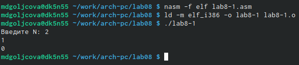{#fig:007 width=70%}

Создала файл lab8-2.asm в каталоге ~/work/arch-pc/lab08 (рис. @fig:008).

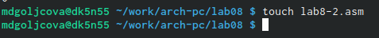{#fig:008 width=70%}

Ввела в него текст программы из листинга 8.2 (рис. @fig:009).

{#fig:009 width=70%}

Создала исполняемый файл и запустила его, указав аргументы (рис. @fig:010).

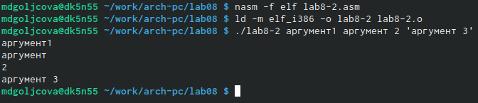{#fig:010 width=70%}

Создала файл lab8-3.asm в каталоге ~/work/arch-pc/lab08 (рис. @fig:011).

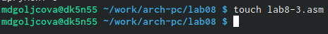{#fig:011 width=70%}

Ввела в него текст программы из листинга 8.3 (рис. @fig:012).

{#fig:012 width=70%}

Создала исполняемый файл и запустила его, указав аргументы (рис. @fig:013).

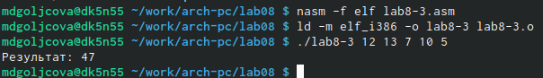{#fig:013 width=70%}

Изменила текст программы из листинга 8.3 для вычисления произведения аргументов
командной строки (рис. @fig:014).

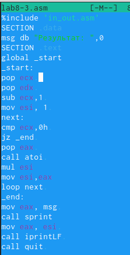{#fig:014 width=70%}

Создала исполняемый файл и запустила его, указав аргументы (рис. @fig:015).

{#fig:015 width=70%}

#Задание для самостоятельной работы

Создала файл lab8-4.asm в каталоге ~/work/arch-pc/lab08 (рис. @fig:016).

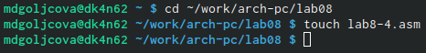{#fig:016 width=70%}

Напишите программу в соответствии со своим вариантом 1, которая находит сумму значений функции 𝑓(𝑥) для
𝑥 = 𝑥1, 𝑥2, ..., 𝑥𝑛, т.е. программа должна выводить значение 𝑓(𝑥1) + 𝑓(𝑥2) + ... + 𝑓(𝑥𝑛) (рис. @fig:017).

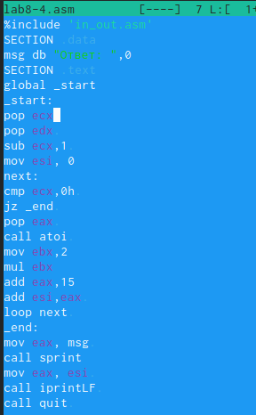{#fig:017 width=70%}

Создала исполняемый файл и проверила его работу на аргументах 1 2 3 4 (рис. @fig:018).

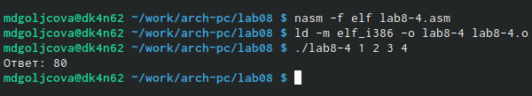{#fig:018 width=70%}

Проверила его работу на аргументах 7 10 23 3 (рис. @fig:019).

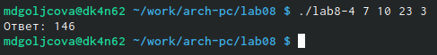{#fig:019 width=70%}

# Выводы

В ходе работы я приобрела навыки написания программ с использованием циклов и обработкой
аргументов командной строки.

# Список литературы{.unnumbered}

::: {#refs}
:::
