---
## Front matter
title: "Отчёт по лабораторной работе №10"
subtitle: "Дисциплина: архитектура компьютера"
author: "Мария Данииловна Гольцова"

## Generic otions
lang: ru-RU
toc-title: "Содержание"

## Bibliography
bibliography: bib/cite.bib
csl: pandoc/csl/gost-r-7-0-5-2008-numeric.csl

## Pdf output format
toc: true # Table of contents
toc-depth: 2
lof: true # List of figures
lot: true # List of tables
fontsize: 12pt
linestretch: 1.5
papersize: a4
documentclass: scrreprt
## I18n polyglossia
polyglossia-lang:
  name: russian
  options:
	- spelling=modern
	- babelshorthands=true
polyglossia-otherlangs:
  name: english
## I18n babel
babel-lang: russian
babel-otherlangs: english
## Fonts
mainfont: PT Serif
romanfont: PT Serif
sansfont: PT Sans
monofont: PT Mono
mainfontoptions: Ligatures=TeX
romanfontoptions: Ligatures=TeX
sansfontoptions: Ligatures=TeX,Scale=MatchLowercase
monofontoptions: Scale=MatchLowercase,Scale=0.9
## Biblatex
biblatex: true
biblio-style: "gost-numeric"
biblatexoptions:
  - parentracker=true
  - backend=biber
  - hyperref=auto
  - language=auto
  - autolang=other*
  - citestyle=gost-numeric
## Pandoc-crossref LaTeX customization
figureTitle: "Рис."
tableTitle: "Таблица"
listingTitle: "Листинг"
lofTitle: "Список иллюстраций"
lotTitle: "Список таблиц"
lolTitle: "Листинги"
## Misc options
indent: true
header-includes:
  - \usepackage{indentfirst}
  - \usepackage{float} # keep figures where there are in the text
  - \floatplacement{figure}{H} # keep figures where there are in the text
---

# Цель работы

Приобретение навыков написания программ для работы с файлами.

# Выполнение лабораторной работы

Создала каталог для программ лабораторной работы №10, перешла в него и
создала файлы lab10-1.asm, readme-1.txt и readme-2.txt (рис. @fig:001).

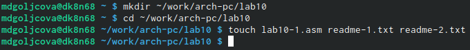{#fig:001 width=70%}

Ввела в файл lab10-1.asm текст программы из листинга 10.1 (рис. @fig:002).

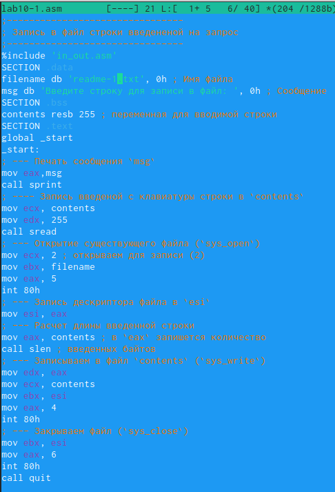{#fig:002 width=70%}

Создала исполняемый файл и проверила его работу (рис. @fig:003).

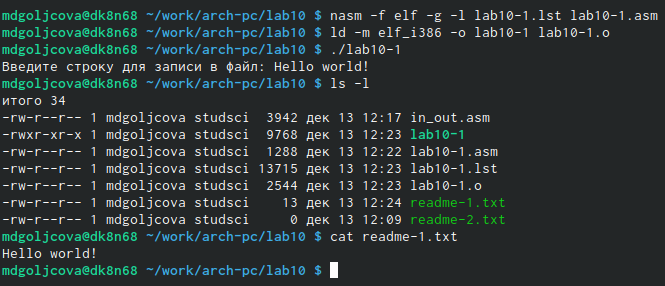{#fig:003 width=70%}

С помощью команды chmod изменила права доступа к исполняемому файлу lab10-1,
запретив его выполнение (рис. @fig:004).

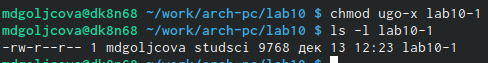{#fig:004 width=70%}

Пробую запустить файл, но мне отказывают в доступе (рис. @fig:005).

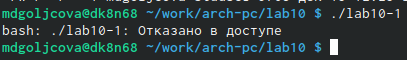{#fig:005 width=70%}

С помощью команды chmod изменила права доступа к файлу lab10-1.asm с исходным
текстом программы, добавив права на исполнение (рис. @fig:006).

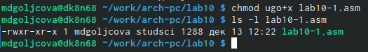{#fig:006 width=70%}

Попыталась выполнить файл (рис. @fig:007).

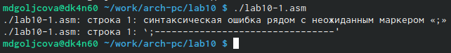{#fig:007 width=70%}

В соответствии с вариантом (1) в таблице 10.4 предоставила права доступа к файлу readme-1.txt, 
представленные в символьном виде, а для файла readme-2.txt – в двочном виде.
Проверила правильность выполнения с помощью команды ls -l (рис. @fig:008).

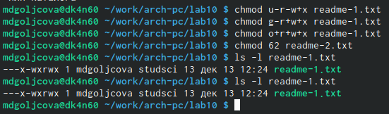{#fig:008 width=70%}

Создала файл для самостоятельной работы (рис. @fig:009).

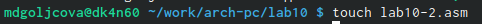{#fig:009 width=70%}

Написала программу, работающую по следующему алгоритму:
• Вывод приглашения “Как Вас зовут?”
• ввести с клавиатуры свои фамилию и имя
• создать файл с именем name.txt
• записать в файл сообщение “Меня зовут”
• дописать в файл строку введенную с клавиатуры
• закрыть файл  (рис. @fig:010) (рис. @fig:011).

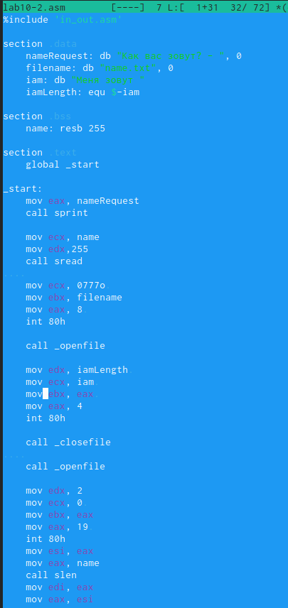{#fig:010 width=70%}
.

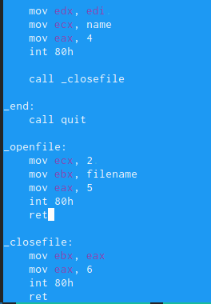{#fig:011 width=70%}

Создала исполняемый файл и проверила его работу. Проверила наличие файла и его
содержимое с помощью команд ls и cat (рис. @fig:012).

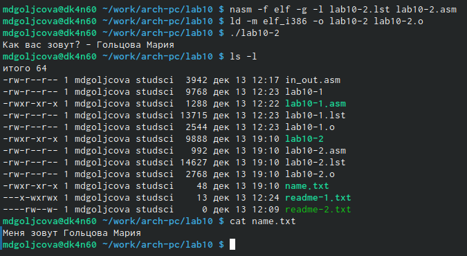{#fig:012 width=70%}

# Выводы

В ходе работы я приобрела навыки написания программ для работы с файлами.

# Список литературы{.unnumbered}

::: {#refs}
:::
